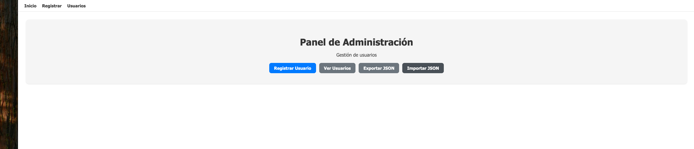
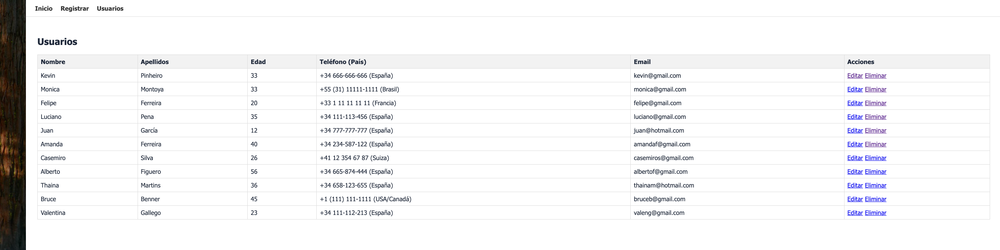
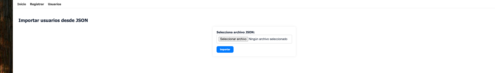

# Panel de Usuarios con Flask

Aplicación web profesional para la gestión de usuarios, desarrollada con **Flask** y **SQLAlchemy**.

## Características principales

- **CRUD completo** de usuarios (crear, listar, editar, eliminar)
- **Base de datos SQLite** gestionada con SQLAlchemy
- **Validaciones robustas** en backend para todos los campos
- **Contraseñas protegidas** con hash seguro (`werkzeug.security`)
- **Importación y exportación** de usuarios en formato JSON
- **Detección automática de país** por prefijo telefónico (+34, +1, +44…)
- **Interfaz moderna y responsiva** con feedback visual (mensajes flash)
- **Manejo de errores** amigable para el usuario
- **Secret key** cargada desde variable de entorno (seguridad en producción)

## Capturas de pantalla

| Pantalla | Vista |
|----------|-------|
| Menú principal |  |
| Formulario de registro |  |
| Tabla de usuarios |  |
| Importar JSON |  |

## Requisitos

- Python 3.10+
- Flask 3.x
- Flask-SQLAlchemy 3.x

## Instalación y ejecución

1. Clona el repositorio:
   ```bash
   git clone https://github.com/tu-usuario/proyecto_flask.git
   cd proyecto_flask
   ```

2. Crea un entorno virtual e instálalo:
   ```bash
   python -m venv venv
   source venv/bin/activate  # En Windows: venv\Scripts\activate
   pip install -r requirements.txt
   ```

3. (Opcional) Configura la clave secreta para producción:
   ```bash
   export SECRET_KEY="tu-clave-secreta-aqui"
   ```

4. Ejecuta la aplicación:
   ```bash
   python app.py
   ```

5. Abre tu navegador en [http://localhost:5000](http://localhost:5000)

## Estructura del proyecto

```
proyecto_flask/
├── app.py                  # Aplicación principal (rutas, modelo, config)
├── requirements.txt        # Dependencias del proyecto
├── utils/
│   └── validaciones.py     # Funciones de validación de datos
├── templates/
│   ├── base.html           # Plantilla base con navegación
│   ├── menu.html           # Página de inicio
│   ├── form.html           # Formulario de registro/edición
│   ├── tabla.html          # Tabla de usuarios
│   └── importar_json.html  # Formulario de importación JSON
├── static/
│   └── style.css           # Estilos de la aplicación
├── screenshots/            # Capturas de pantalla
└── instance/               # Base de datos SQLite (autogenerada)
```

## Mejoras respecto al Proyecto Inicial

- Uso de base de datos en vez de solo JSON
- Validaciones avanzadas y mensajes claros
- Contraseñas seguras (hash)
- Interfaz profesional y fácil de usar
- Importación/exportación JSON accesible desde el menú
- Secret key cargada desde variable de entorno
- Contraseñas re-hasheadas al importar desde JSON
- Compatibilidad con SQLAlchemy 2.x (`db.get_or_404`)
- Rutas de exportación con paths absolutos

---

Desarrollado por Kevin — Proyecto para curso de Python.
